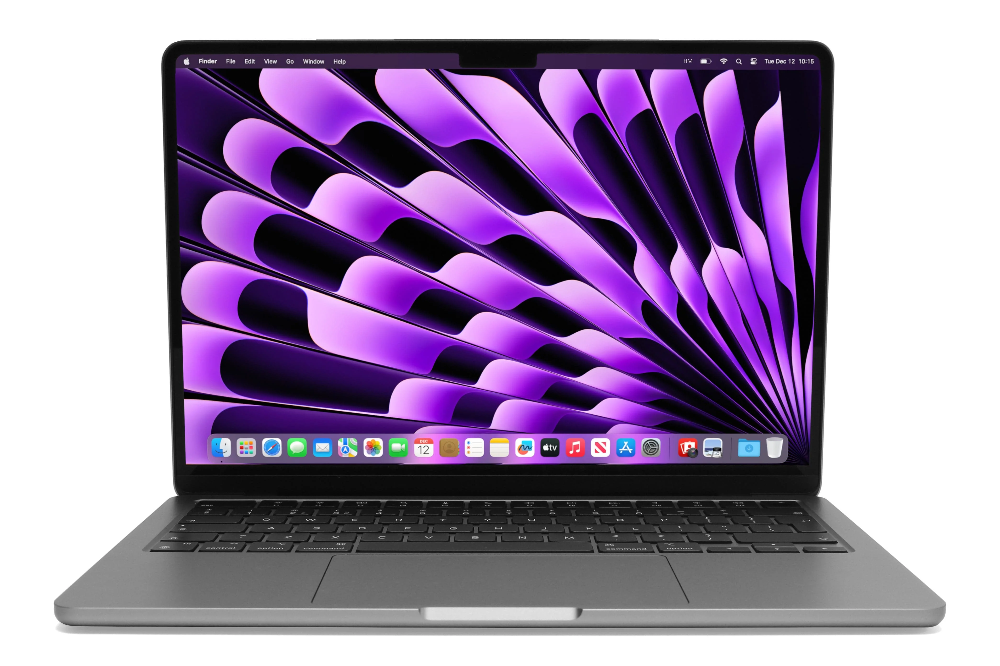

# Classic-Computer-Stan

## 2008 Macbook Air

![My Image]

Processor: Penryn-3M Intel Core 2 Duo (T8300)

Storage: 2GB (two 1GB) of 800MHz DDR2 ECC fully buffered DIMM

Memory: 8GB
_____________________________________________________________________________________________________________________________________________________________________________________________

## 2022 Macbook Air

GPU: GeForce 9600M GT graphics card, as well as a secondary GeForce 9400M graphics card with 256MB of VRAM.

Processor type and speed With an 8-core M2 processor running at 3.5GHz, an 8-core integrated GPU

Memory: 8GB of memory

storage:a 512GB SSD.
